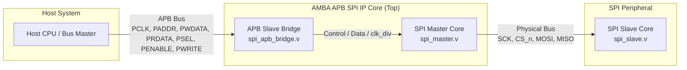

# AMBA APB-to-SPI Controller IP Core (Verilog HDL)

An **AMBA APB (Advanced Peripheral Bus) Compliant SPI Controller IP Core** designed in Verilog HDL for SoC (System-on-Chip) peripheral integration. The IP features a full 32-bit APB Slave Interface bridge (`spi_apb_bridge`), dynamic clock scaling prescaler, and CPU status polling capabilities.

---

## Key Features

### 1. AMBA APB Slave Bus Protocol Compliance
* Fully compliant with 32-bit AMBA APB specification handling **Setup Phase** (`PSEL=1, PENABLE=0`) and **Access Phase** (`PSEL=1, PENABLE=1`).
* Zero-wait-state transfers (`PREADY = 1`).

### 2. Memory-Mapped Register File (32-bit)
* Provides memory-mapped control, status, data transmit/receive, and clock configuration registers accessible by the host CPU via APB bus transfers.

### 3. Dynamic Clock Prescaler
* Integrated dynamic clock divider ratio (`clk_div`) in the SPI Master core, runtime-configurable via APB Configuration Register (`CFG_REG`).

### 4. Status Polling & Busy Flag
* Host CPU can poll the `READY` bit in `STATUS_REG` over the APB bus to detect transaction completion before reading received data from `RX_REG`.

---

## CDC (Clock Domain Crossing) Handling

To prevent metastability and unintended gated-clock glitches, the design utilizes a **Single-Clock Domain Synchronous Strobe** approach. Instead of generating a physical divided clock, the SPI Master operates entirely on the `PCLK` domain. Dynamic clock scaling is achieved by generating synchronous `sck_rise` and `sck_fall` strobe flags, ensuring 100% data integrity and zero setup/hold violations across clock domains.

---

## APB Memory Map & Register Definitions

| Offset Address | Register Name | Access Type | Reset Value | Description |
| :---: | :---: | :---: | :---: | :--- |
| `0x00` | `CTRL_REG` | Write / Read | `0x00000000` | **Control Register:** Write `1` to Bit 0 (`start`) to trigger an 8-bit transaction. Auto-clears upon execution. |
| `0x04` | `STATUS_REG` | Read-only | `0x00000001` | **Status Register:** Bit 0 (`ready`). `1` = Idle/Ready, `0` = SPI Master Busy. |
| `0x08` | `TX_REG` | Write / Read | `0x00000000` | **Transmit Data Register:** Lower 8 bits (`[7:0]`) contain data to be transmitted over MOSI. |
| `0x0C` | `RX_REG` | Read-only | `0x00000000` | **Receive Data Register:** Lower 8 bits (`[7:0]`) contain data received from MISO. |
| `0x10` | `CFG_REG` | Write / Read | `0x00000004` | **Clock Config Register:** Lower 8 bits (`[7:0]`) specify the clock divider ratio (`clk_div`). Default = 4. |

---

## System Architecture



---

## ASIC Physical Design (RTL-to-GDSII)

The IP core was successfully pushed through the complete **Physical Design Flow** using **OpenLane / OpenROAD** and the **SkyWater 130nm PDK**. The flow includes Logic Synthesis, Floorplanning, Power Distribution Network (PDN) Generation, Placement, Clock Tree Synthesis (CTS), Routing, and Signoff.

### PPA Metrics & Signoff Results (Sky130)
| Metric | Value | Note |
| :--- | :--- | :--- |
| **Target Frequency** | 50 MHz | Period: 20 ns |
| **Die Area** | 0.011 mm² | `89.66 um x 89.80 um` |
| **Total Cell Count** | 1,062 Cells | 366 standard cells + 696 Tap/Decap/Fill cells |
| **Total Power** | 306 µW | Typical corner |
| **STA (Timing Closure)**| WNS = 0.0 ns, TNS = 0.0 ns | Zero Setup/Hold Violations |
| **Physical Signoff** | **0 DRC / 0 LVS / 0 Antenna** | Magic (DRC) & Netgen (LVS) Clean |
| **Routing Congestion** | 16.41% | 0 Overflow, 5 Metal Layers Used |

### Layout & CTS Visualization

**Final GDSII Layout (Routing on 5 Metal Layers)**
<p align="center">
  
</p>

**Clock Tree Synthesis (CTS) - H-Tree Topology**
*(Clock Skew optimized to an ultra-low 0.02 ns)*
<p align="center">
  
</p>

---

## Verification & Waveform Results

The testbench (`tb/tb_apb.v`) simulates host CPU APB register write/read tasks and status polling loops.


### Verification Steps Demonstrated:
1. **Clock Divider Config:** APB Write `6` to `CFG_REG` (`0x10`), verified by APB Read returning `6`.
2. **Tx Data Load:** APB Write `0xA5` to `TX_REG` (`0x08`), verified by APB Read returning `0xA5`.
3. **Trigger Transaction:** APB Write `1` to `CTRL_REG` (`0x00`) to pulse `start`.
4. **CPU Status Polling:** CPU repeatedly reads `STATUS_REG` (`0x04`) until `READY = 1`.
5. **Rx Data Read:** APB Read from `RX_REG` (`0x0C`) returns `0x5A` received from SPI Slave.

---

## How to Run Simulation

### Prerequisites
* EDA Tool: QuestaSim / ModelSim (Intel FPGA Edition or standard).

### Steps:
1. Open **QuestaSim / ModelSim**.
2. Change directory to the `sim/` folder:
   ```tcl
   cd "sim"
   ```
3. Run the TCL simulation script:
   ```tcl
   do run.tcl
   ```

---

## Repository Structure

```text
AMBA-APB-SPI-Controller/
├── README.md                      # Project documentation
├── .gitignore                     # Git ignore rules for EDA build outputs
├── docs/                          # Waveform and Physical Design screenshots
│   ├── apb_spi_transaction_waveform.png
│   ├── cts_htree.png              # CTS Clock Tree visual
│   └── gds_layout.png             # Final GDSII Layout visual
├── pd_reports/                    # Physical Design metrics and final GDS
│   ├── metrics.csv                # OpenLane PPA report
│   └── spi_apb_top.gds            # Final Tape-out ready GDSII layout
├── rtl/                           # Verilog HDL RTL source files
│   ├── SPI_apb_top.v              # Top-level Wrapper integrating APB Bridge & SPI Master
│   ├── SPI_apb_bridge.v           # AMBA APB Slave Interface Bridge & Register File
│   ├── SPI_Master.v               # SPI Master Core
│   └── SPI_Slave.v                # SPI Slave Core (Verification Model)
├── tb/                            # Verification Testbench
│   └── tb_apb.v                   # APB Bus Transfer Testbench
└── sim/                           # Simulation Scripts
    └── run.tcl                    # QuestaSim TCL script
```

---

## Author

* **Role:** RTL Design, Physical Design & Verification Engineer
