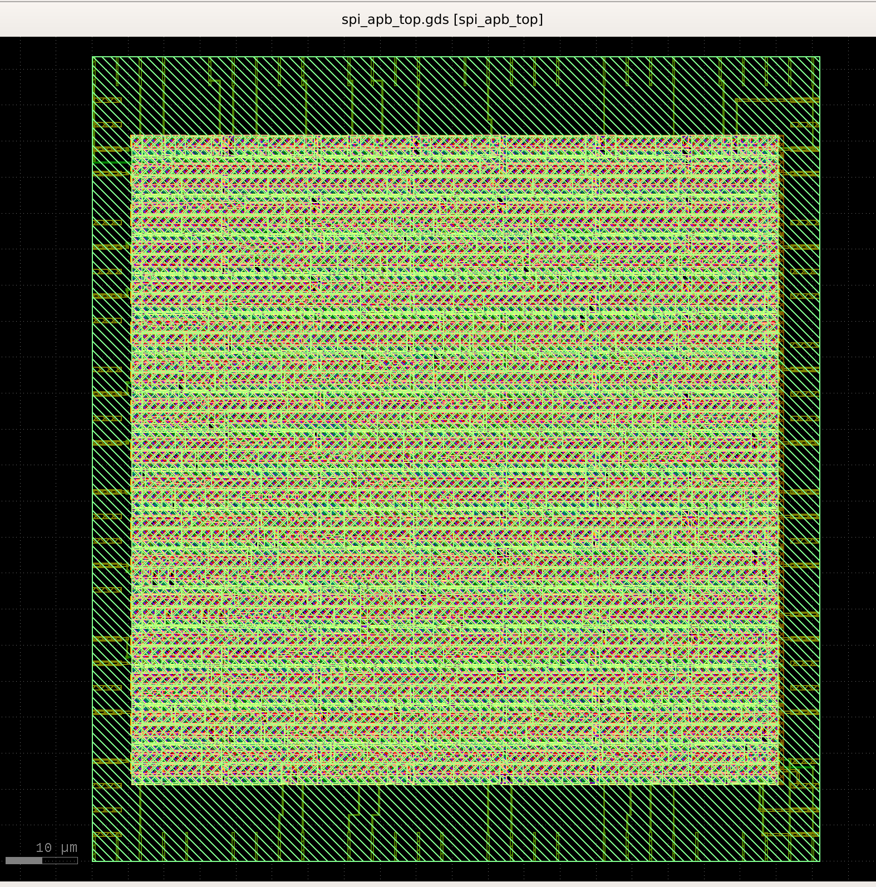
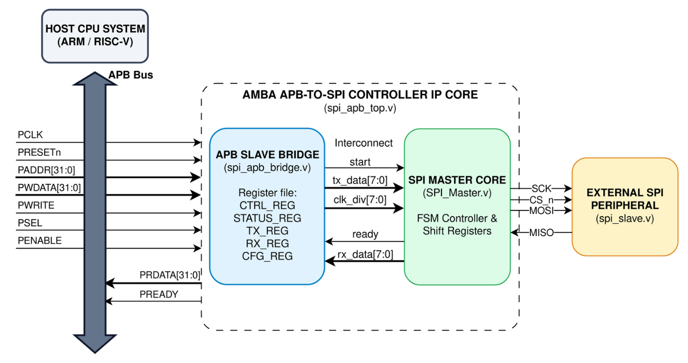
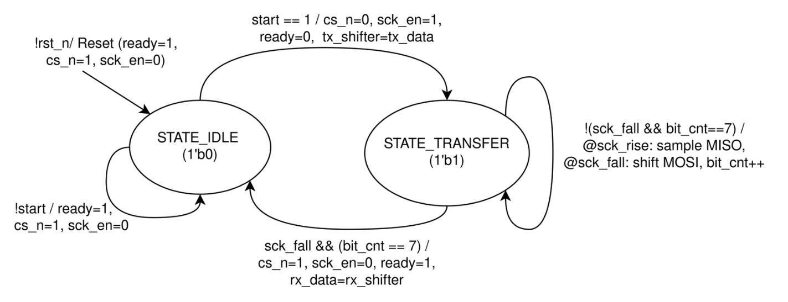
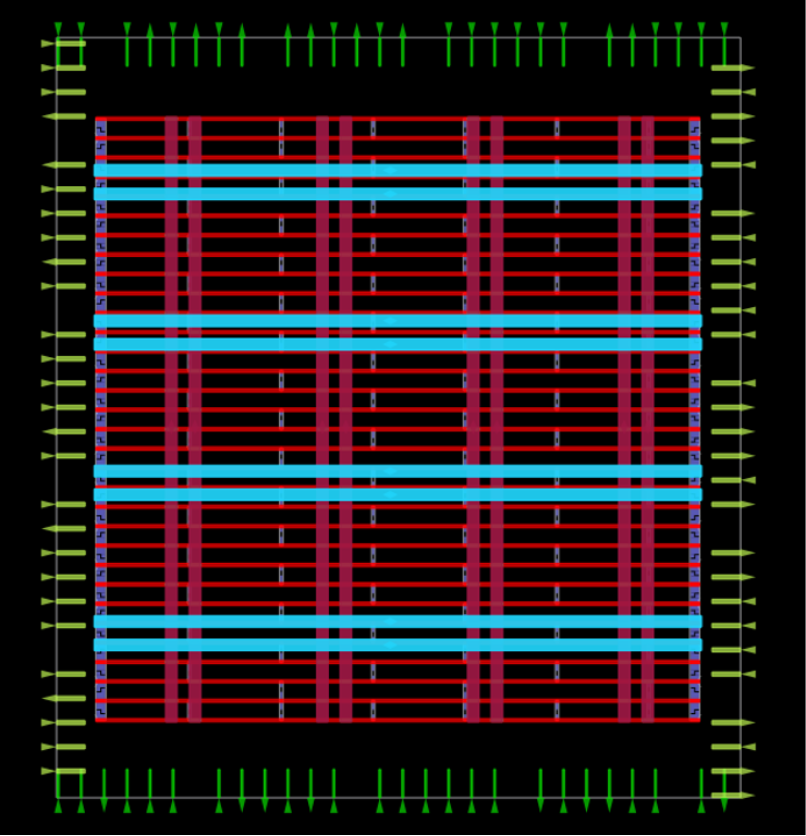
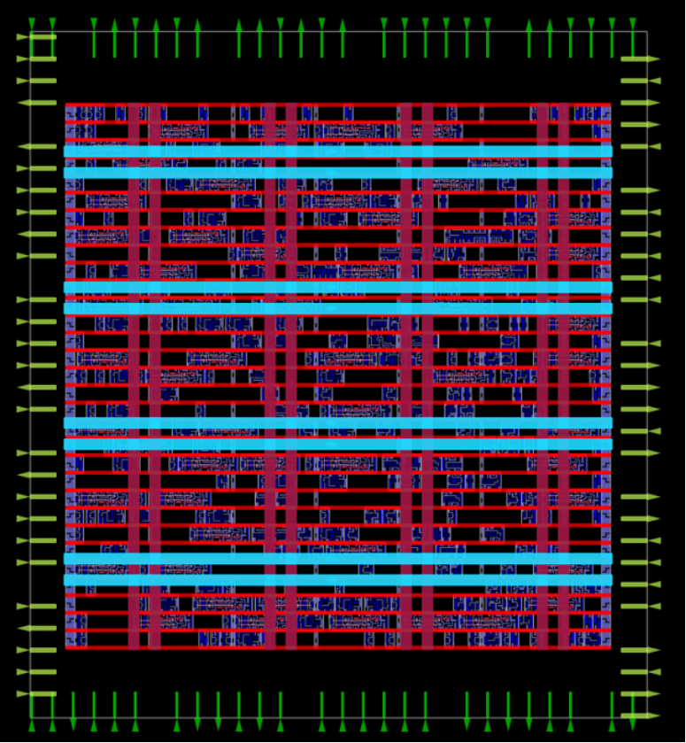
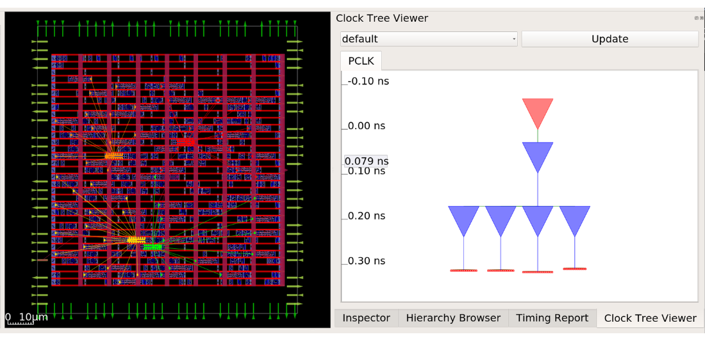
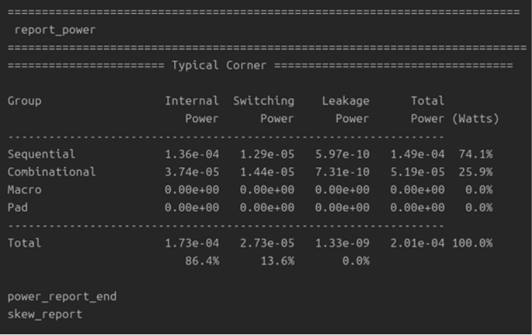
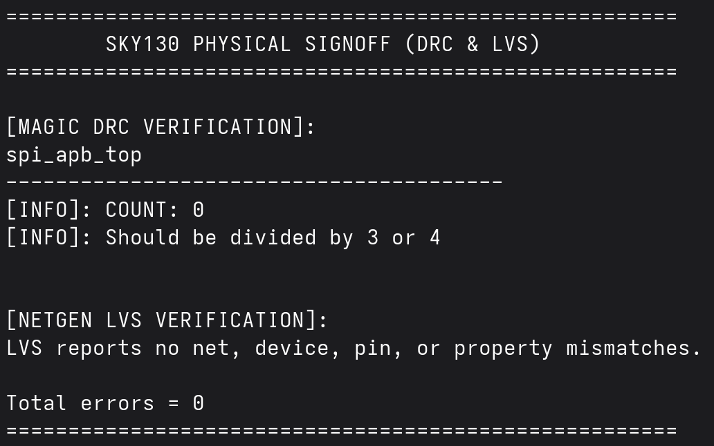

# AMBA APB-to-SPI Controller IP Core (Sky130)

<p align="center">
  <br><i>Final Chip Layout (GDSII) after Routing on 5 Metal Layers</i>
</p>

This project is a complete hardware implementation—from RTL code to a final physical chip layout (GDSII)—of an **AMBA APB (Advanced Peripheral Bus) Compliant SPI Controller IP Core**. Designed for SoC peripheral integration, the core features a full 32-bit APB Slave Interface bridge, dynamic clock scaling prescaler, and CPU status polling capabilities.

---

## 1. Architecture (RTL Design)

The core is designed in Verilog HDL and strictly separates the APB bus interface from the SPI protocol engine.

### Block Diagram & FSM
<p align="center">
  <br><i>Hardware Architecture Block Diagram</i><br><br>
  <br><i>FSM State Transition Diagram</i>
</p>

- **AMBA APB Compliance:** Fully compliant with 32-bit AMBA APB specification handling Setup Phase (`PSEL=1, PENABLE=0`) and Access Phase (`PSEL=1, PENABLE=1`) with zero-wait-state transfers.
- **Memory-Mapped Register File:** Provides 32-bit registers (`CTRL_REG`, `STATUS_REG`, `TX_REG`, `RX_REG`, `CFG_REG`) accessible by the host CPU.
- **CDC (Clock Domain Crossing) Handling:** To prevent metastability, the design utilizes a **Single-Clock Domain Synchronous Strobe** approach instead of a physical divided clock. Dynamic clock scaling is achieved by generating synchronous `sck_rise` and `sck_fall` strobe flags on the `PCLK` domain.

---

## 2. Verification

A Task-Based Testbench (`tb_apb.v`) was built to simulate host CPU APB register write/read tasks and status polling loops.

### Simulation Waveforms
<p align="center">
  <br><i>Simulation Waveform: APB Transactions and SPI Full-Duplex Transfer</i>
</p>

**Verification Steps Demonstrated:**
1. **Clock Divider Config:** APB Write `6` to `CFG_REG`.
2. **Tx Data Load:** APB Write `0xA5` to `TX_REG`.
3. **Trigger Transaction:** APB Write `1` to `CTRL_REG` to pulse `start`.
4. **CPU Status Polling:** CPU reads `STATUS_REG` until `READY = 1`.
5. **Rx Data Read:** APB Read from `RX_REG` returns `0x5A`.

---

## 3. Physical Design Flow (OpenLane / Sky130)

The IP core was successfully taped-out using the **OpenLane RTL-to-GDSII** flow targeting the open-source **Skywater 130nm (sky130A)** PDK.

### Step 1: Synthesis & Floorplan
The RTL was synthesized into standard cells. A die area of `0.011 mm²` was defined, and a robust Power Distribution Network (PDN) was generated.
<p align="center">
  <br><i>Floorplan: Die Area and PDN Generation</i>
</p>

### Step 2: Placement & Clock Tree Synthesis (CTS)
Global and detailed placement of standard cells was executed, followed by Clock Tree Synthesis. An H-Tree topology was synthesized to minimize clock skew across the core.
<p align="center">
  <br><i>Global and Detailed Placement</i><br><br>
  <br><i>Clock Tree Synthesis (CTS) - H-Tree Topology (Skew optimized to 0.02 ns)</i>
</p>

### Step 3: Power Estimation & Signoff Verification
Global and detailed routing was completed on 5 metal layers with 0 overflow (16.41% congestion). Final verification included Static Timing Analysis (STA), achieving **WNS = 0.0 ns and TNS = 0.0 ns** at 50 MHz. Physical Signoff passed with absolute zero DRC, LVS, and Antenna violations.
<p align="center">
  <br><i>Power Report: Total Power Dissipation is 201 µW at Typical Corner</i><br><br>
  <br><i>Physical Signoff: Zero DRC and LVS Violations (Netgen & Magic)</i>
</p>

**Final Implementation Statistics:**
- **Die Area:** 0.011 mm²
- **Total Physical Cells:** 1,062 (Includes 366 standard logic cells + 696 Tap/Decap/Fill cells)
- **Total Power:** 201 µW
- **Target Frequency:** 50 MHz

---

## Directory Structure

```text
AMBA-APB-SPI-Controller/
├── docs/                 # Documentation and flow images
├── pd_reports/           # Physical Design metrics and final GDS
├── rtl/                  # Verilog HDL RTL source files
├── sim/                  # Simulation Scripts
├── tb/                   # Verification Testbench
└── README.md             # This file
```

## How to Run

```bash
git clone https://github.com/hairui-chin/AMBA-APB-SPI-Controller.git
cd AMBA-APB-SPI-Controller/sim
do run.tcl
```
